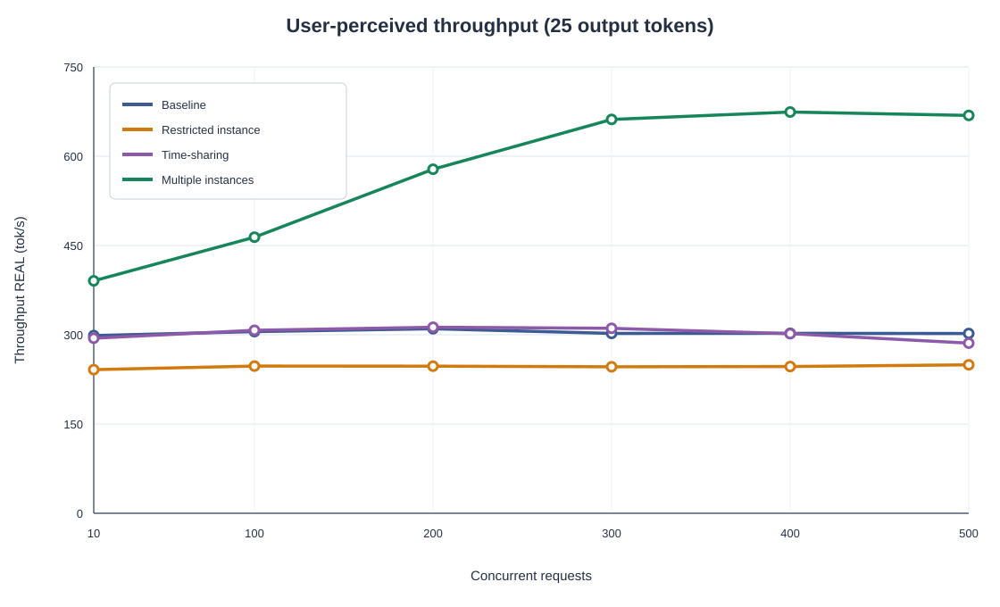
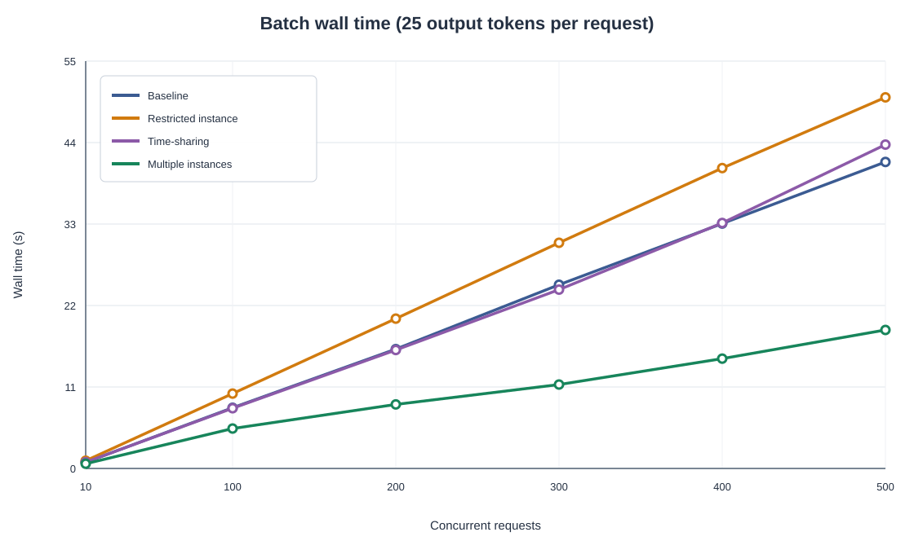
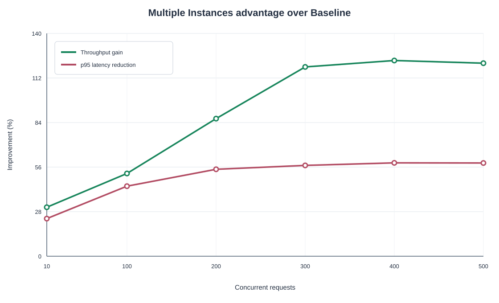
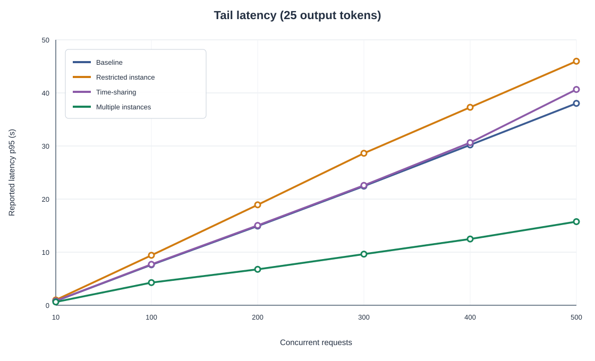
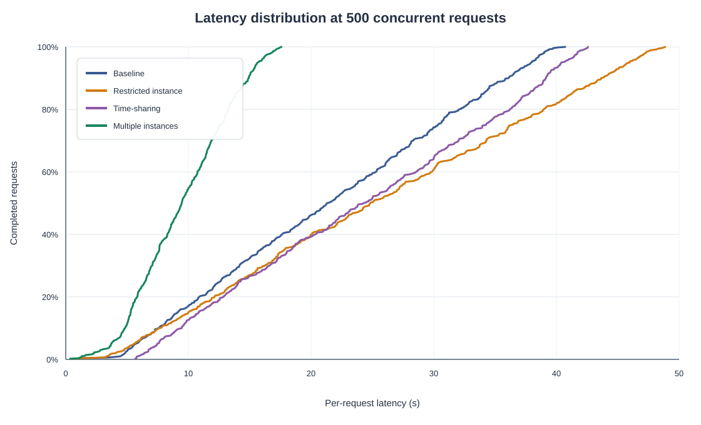

# Analisi approfondita dell'esperimento Ollama

## Executive summary

L'esperimento mostra che il vantaggio dell'architettura non deriva dal semplice aumento del numero di Pod Ollama, ma dalla disponibilità di **più risorse MIG hardware-indipendenti** sulle quali eseguire le richieste in parallelo.

- La configurazione **Multiple Instances** (`7 × 1g.5gb`, sette Pod con claim distinti) è l'unica che scala chiaramente con la concorrenza. A 400 richieste raggiunge `674.22 tok/s`, contro `302.37 tok/s` della baseline: `2.23×`, cioè `+122.98%` di throughput REAL. Il wall time scende da `33.07 s` a `14.83 s` (`-55.16%`), la latenza media da `17.10 s` a `7.57 s` (`-55.74%`) e la p95 da `30.20 s` a `12.48 s` (`-58.66%`).
- A 500 richieste il risultato rimane simile (`668.56` contro `302.10 tok/s`, `2.21×`), ma il throughput non cresce più: il massimo osservato è a concorrenza 400. Tra 400 e 500 compare quindi un plateau, con una lieve regressione del throughput.
- La configurazione **Time-Sharing** (sette Pod sullo stesso `7g.40gb`) non aumenta la capacità. Il throughput medio sui sei punti è `302.11 tok/s`, quasi identico ai `303.47 tok/s` della baseline. A concorrenza 500 è persino inferiore del `5.38%`, con latenza media superiore del `12.67%`.
- La **Restricted Instance** (`3g.20gb`, un Pod) conserva circa l'`81%` del throughput della baseline pur usando 42 SM invece dei 98 SM esposti dal profilo `7g.40gb`. Questo indica che TinyLlama non sfrutta proporzionalmente la partizione più grande. La partizione ridotta è quindi ragionevole quando la priorità è liberare capacità per altri workload, non quando si vuole minimizzare la latenza di quella singola coda.
- La latenza è dominata dalla coda. A concorrenza 500 il tempo di generazione medio è solo `0.054 s` nella baseline e `0.167 s` nelle Multiple Instances, mentre la parte non attribuita alla generazione vale rispettivamente `21.50 s` e `9.41 s`.
- Il **Throughput GPU** non deve essere usato per confrontare la capacità aggregata delle configurazioni parallele: somma durate che si sovrappongono temporalmente. Per Multiple Instances a concorrenza 400 riporta soltanto `151.14 tok/s`, mentre il throughput realmente consegnato è `674.22 tok/s`.

La conclusione utile per la tesi è quindi circoscritta ma forte: per richieste brevi e numerose, un modello che entra comodamente in `1g.5gb` beneficia molto più di sette code di servizio su sette partizioni MIG isolate che di sette server concorrenti sulla stessa partizione. In questo PoC DRA abilita il provisioning dei device ai Pod, ma il guadagno prestazionale osservato è prodotto soprattutto da **MIG + replica del serving + bilanciamento delle richieste**; non è una dimostrazione di riallocazione dinamica durante la vita del servizio.

## 1. Perimetro e completezza del dataset

Sono stati analizzati tutti i file direttamente presenti in [`results/`](results/), escludendo inizialmente la sottocartella `not-25` come richiesto. Le run in `not-25` sono state poi usate soltanto nella sezione 9, come evidenza secondaria sull'effetto della lunghezza dell'output.

Il dataset normalizzato contiene:

- 25 coppie `.log` + `.csv`, tutte con `eval_count = 25` per ogni richiesta;
- 24 punti nel disegno principale: quattro test case per sei livelli di concorrenza (`10`, `100`, `200`, `300`, `400`, `500`);
- una run storica aggiuntiva della Restricted Instance, `all-3g.20gb`, a concorrenza 100;
- [`results_table.csv`](results/results_table.csv), che contiene i 24 punti della matrice principale;
- [`results.jsonl`](results/results.jsonl) e [`metadata.json`](results/metadata.json), che sono uno snapshot dell'ultima run (`all-balanced`, una replica, 500 richieste);
- il grafico preesistente [`real_throughput_25_tokens.png`](results/plots/real_throughput_25_tokens.png).

Tutte le run principali hanno `Total requests = Concurrency`: ogni punto è dunque un unico burst in cui tutte le richieste vengono lanciate quasi contemporaneamente. L'asse della concorrenza coincide anche con la dimensione del batch; questa scelta rende corretti i confronti tra test case allo stesso livello, ma non separa l'effetto della concorrenza da quello del numero totale di richieste.

La run storica `all-3g.20gb` a concorrenza 100 produce `256.70 tok/s`, mentre la run `all-balanced` usata nella curva principale produce `247.28 tok/s`. La differenza è del `3.8%`. La serie principale usa `all-balanced` perché è l'unica completa da 10 a 500; la run storica viene conservata come controllo di coerenza, non mescolata alla curva.

## 2. Implementazione dei quattro test case

| Test case | Configurazione | Pod Ollama | Allocazione | Risorse di calcolo considerate | Interpretazione |
|---|---:|---:|---|---:|---|
| Baseline | `all-7g.40gb` | 1 | un device `7g.40gb` | 98 SM | un solo server e una sola grande coda |
| Restricted Instance | `all-balanced` | 1 | un device `3g.20gb` | 42 SM | stessa forma di serving, partizione più piccola |
| Time-Sharing | `all-7g.40gb` | 7 | un `ResourceClaim` condiviso | 98 SM totali | sette server competono sulla stessa partizione |
| Multiple Instances | `all-1g.5gb` | 7 | un claim distinto per ogni Pod | `7 × 14 = 98` SM | sette code e sette partizioni hardware isolate |

I manifest mostrano due topologie diverse:

- [`deploy-ollama.yaml`](../manifests/ollama-experiment/deploy-ollama.yaml) usa un `ResourceClaimTemplate`; ogni replica genera il proprio claim. Con sette `1g.5gb`, ciascun Pod riceve quindi una partizione distinta.
- [`deploy-ollama-shared.yaml`](../manifests/ollama-experiment/deploy-ollama-shared.yaml) crea invece un singolo `ResourceClaim` e lo riferisce da tutte le repliche, implementando il caso condiviso.
- Il Service NodePort seleziona tutti i Pod. [`load-test.sh`](load-test.sh) imposta `Connection: close`, quindi ogni richiesta apre una nuova connessione ed è nuovamente eleggibile per il bilanciamento del Service.
- [`custom-mig-config.yaml`](../manifests/custom-mig-config.yaml) definisce `all-1g.5gb` come sette partizioni `1g.5gb`, `all-7g.40gb` come una `7g.40gb` e `all-balanced` come una `3g.20gb`, una `2g.10gb` e due `1g.5gb`.

Il codice di plotting documenta che, nel test Restricted Instance, il Pod ha usato il profilo `3g.20gb`. I file di risultato non registrano però UUID, profilo o nome del Pod servente. Poiché il selector corrente `whatever-mig` accetta qualunque device MIG, l'allocazione `3g.20gb` è una convenzione sperimentale supportata dagli script e dal setup, ma non può essere ricostruita indipendentemente dai soli CSV.

La baseline è una `7g.40gb`, cioè il profilo MIG massimo dell'A100 40 GB, non l'accesso bare-metal alla GPU fuori da MIG.

## 3. Definizione e interpretazione delle metriche

[`evaluate.py`](evaluate.py) calcola:

```text
wall_time = max(end_time) - min(start_time)
throughput_REAL = somma(eval_count) / wall_time
throughput_GPU = somma(eval_count) / somma(eval_duration)
latency = total_duration restituita da Ollama
```

### 3.1 Metriche primarie

- **Wall time** misura il tempo dal primo avvio client all'ultima risposta e rappresenta il makespan del burst.
- **Throughput REAL** divide tutti i token effettivamente generati per il wall time. È la misura principale della capacità realmente percepita dall'utente.
- **Latency** usa `total_duration` restituita da Ollama. Con 25 token la generazione dura pochi centesimi di secondo; sotto carico quasi tutto il valore è quindi attesa nel serving/scheduler. È ragionevole trattarla come proxy della coda, ricordando che include anche load, prompt evaluation e altri overhead server-side.

### 3.2 Perché il Throughput GPU è fuorviante nel parallelo

La formula del Throughput GPU è corretta come rapporto tra token e somma delle durate di generazione, ma la somma non è un tempo di calendario. Se sette richieste vengono generate contemporaneamente su sette istanze, sette intervalli sovrapposti entrano tutti nel denominatore. Il valore risultante descrive più da vicino la velocità media di generazione per richiesta che la capacità aggregata dell'architettura.

Esempio a concorrenza 400:

| Test case | Throughput REAL | Throughput GPU | Lettura corretta |
|---|---:|---:|---|
| Baseline | 302.37 | 461.00 | un solo flusso di generazione veloce, ma con coda |
| Restricted Instance | 246.57 | 345.88 | generazione singola più lenta, coda più lunga |
| Time-Sharing | 301.79 | 124.63 | durate concorrenti sommate sullo stesso device |
| Multiple Instances | **674.22** | 151.14 | sette intervalli sovrapposti; il valore REAL cattura il parallelismo |

L'anomalia del caso Time-Sharing rafforza questa cautela: il `GPU time` passa da `130.16 s` a concorrenza 300 a `80.23 s` a concorrenza 400, pur aumentando i token da 7,500 a 10,000 e mantenendo circa invariato il throughput REAL. Questa metrica è sensibile al comportamento interno di Ollama e alla sovrapposizione delle richieste; non è una misura di utilization hardware.

### 3.3 Percentile p95

Lo script usa l'elemento in posizione `int(n × 0.95)` della lista ordinata. Non applica interpolazione. Con soltanto dieci richieste il valore indicato come p95 coincide con il massimo. I confronti principali a 100–500 richieste sono molto meno sensibili a questa scelta.

## 4. Risultati completi delle 24 run principali

Latenze espresse in secondi; le sorgenti conservano millisecondi.

| Test case | Conc. | Wall (s) | Throughput REAL (tok/s) | Throughput GPU (tok/s) | Latency avg (s) | Latency p95 (s) |
|---|---:|---:|---:|---:|---:|---:|
| Baseline | 10 | 0.84 | 298.69 | 462.71 | 0.478 | 0.807 |
| Baseline | 100 | 8.19 | 305.29 | 453.98 | 4.269 | 7.624 |
| Baseline | 200 | 16.12 | 310.08 | 453.47 | 8.117 | 14.917 |
| Baseline | 300 | 24.81 | 302.26 | 454.88 | 12.719 | 22.442 |
| Baseline | 400 | 33.07 | 302.37 | 461.00 | 17.102 | 30.195 |
| Baseline | 500 | 41.38 | 302.10 | 462.47 | 21.555 | 38.026 |
| Restricted Instance | 10 | 1.04 | 241.31 | 345.52 | 0.588 | 0.999 |
| Restricted Instance | 100 | 10.11 | 247.28 | 344.81 | 5.261 | 9.410 |
| Restricted Instance | 200 | 20.23 | 247.21 | 345.83 | 10.479 | 18.921 |
| Restricted Instance | 300 | 30.47 | 246.17 | 346.06 | 15.797 | 28.634 |
| Restricted Instance | 400 | 40.56 | 246.57 | 345.88 | 20.925 | 37.287 |
| Restricted Instance | 500 | 50.10 | 249.48 | 344.75 | 25.384 | 45.969 |
| Time-Sharing | 10 | 0.85 | 294.12 | 124.97 | 0.578 | 0.819 |
| Time-Sharing | 100 | 8.13 | 307.50 | 57.99 | 4.352 | 7.710 |
| Time-Sharing | 200 | 15.99 | 312.66 | 59.68 | 8.179 | 15.039 |
| Time-Sharing | 300 | 24.14 | 310.73 | 57.62 | 12.221 | 22.579 |
| Time-Sharing | 400 | 33.14 | 301.79 | 124.63 | 16.850 | 30.644 |
| Time-Sharing | 500 | 43.73 | 285.86 | 134.14 | 24.286 | 40.645 |
| Multiple Instances | 10 | 0.64 | 390.62 | 164.92 | 0.370 | 0.616 |
| Multiple Instances | 100 | 5.39 | 463.99 | 158.95 | 2.096 | 4.269 |
| Multiple Instances | 200 | 8.65 | 578.17 | 155.77 | 3.949 | 6.768 |
| Multiple Instances | 300 | 11.33 | 661.78 | 150.22 | 5.776 | 9.633 |
| Multiple Instances | 400 | 14.83 | **674.22** | 151.14 | 7.569 | 12.483 |
| Multiple Instances | 500 | 18.70 | 668.56 | 149.78 | 9.572 | 15.748 |





## 5. Throughput, dimensione delle partizioni e punto di saturazione

### 5.1 Baseline: la grande partizione non scala con nuove richieste

La baseline rimane tra `298.69` e `310.08 tok/s` su tutto l'intervallo. Il coefficiente di variazione dei sei punti è soltanto `1.16%`. Il server è quindi già prossimo alla propria capacità con dieci richieste concorrenti; aggiungere richieste aumenta la coda, non il throughput.

La velocità media di generazione per singola richiesta è circa `454–463 tok/s`, ma il throughput REAL è circa `302–310 tok/s`. La differenza è dovuta a prompt evaluation, scheduling, trasferimenti e altri overhead; soprattutto, una sola coda non trasforma tutta la velocità di decode in capacità aggregata percepita.

### 5.2 Restricted Instance: forte rendimento marginale della partizione piccola

Il throughput rimane tra `241.31` e `249.48 tok/s`, con coefficiente di variazione `1.01%`. Anche la `3g.20gb` è già satura a concorrenza 10.

Rispetto alla baseline, la perdita di throughput è abbastanza stabile: tra `-17.42%` e `-20.28%`. La riduzione di risorse allocate è invece molto maggiore: da 98 a 42 SM (`-57.14%`). A concorrenza 400:

| Test case | SM allocati | Throughput REAL | tok/s per SM allocato |
|---|---:|---:|---:|
| Baseline | 98 | 302.37 | 3.09 |
| Restricted Instance | 42 | 246.57 | **5.87** |
| Time-Sharing | 98 | 301.79 | 3.08 |
| Multiple Instances | 98 | 674.22 | **6.88** |

`tok/s per SM` è soltanto una normalizzazione, non una misura di efficienza energetica o utilization. Tuttavia mostra il rendimento decrescente della partizione grande per TinyLlama: più del doppio degli SM non produce il doppio del throughput.

La Restricted Instance è quindi utile se le altre partizioni della geometria `all-balanced` vengono assegnate ad altri tenant o workload. Se restano inattive, l'utente vede soltanto un servizio più lento senza ottenere il beneficio di consolidamento a livello cluster.

### 5.3 Time-Sharing: più server non equivalgono a più capacità

Il throughput medio delle sei run è `302.11 tok/s`, contro `303.47 tok/s` della baseline. Le differenze tra concorrenza 10 e 400 sono entro circa ±3%; senza repliche indipendenti non sono distinguibili in modo affidabile dal rumore sperimentale.

A concorrenza 500 il risultato peggiora:

- throughput: `285.86` contro `302.10 tok/s` (`-5.38%`);
- wall time: `43.73` contro `41.38 s` (`+5.68%`);
- latenza media: `24.29` contro `21.56 s` (`+12.67%`);
- p95: `40.65` contro `38.03 s` (`+6.89%`).

I sette Pod introducono sette processi Ollama, sette copie/runner del modello e più contesti concorrenti, ma tutti competono per gli stessi SM e la stessa banda del `7g.40gb`. Il Service distribuisce le connessioni, ma il collo di bottiglia hardware non cambia. Il risultato empirico è coerente con context contention e overhead di scheduling, non con un aumento di capacità.

Questo caso va chiamato con precisione: è **condivisione applicativa dello stesso device fra sette Pod attraverso un claim comune**. Non dimostra l'uso della modalità time-slicing del device plugin NVIDIA, né l'uso di MPS.

### 5.4 Multiple Instances: parallelismo reale e plateau a 400 richieste

Il throughput cresce con la concorrenza:

| Concorrenza | Throughput REAL | Speedup vs baseline | Variazione throughput | Riduzione wall time | Riduzione latenza media | Riduzione p95 |
|---:|---:|---:|---:|---:|---:|---:|
| 10 | 390.62 | 1.31× | +30.78% | 23.81% | 22.60% | 23.63% |
| 100 | 463.99 | 1.52× | +51.98% | 34.19% | 50.89% | 44.01% |
| 200 | 578.17 | 1.86× | +86.46% | 46.34% | 51.35% | 54.63% |
| 300 | 661.78 | 2.19× | +118.94% | 54.33% | 54.58% | 57.08% |
| 400 | **674.22** | **2.23×** | **+122.98%** | **55.16%** | **55.74%** | **58.66%** |
| 500 | 668.56 | 2.21× | +121.30% | 54.81% | 55.59% | 58.59% |



La crescita fino a 400 richieste indica che è necessaria sufficiente concorrenza per tenere occupate tutte le sette code. Tra 400 e 500 il throughput scende dello `0.84%` e wall time e latenza continuano a crescere: il sistema ha raggiunto la propria capacità utile nelle condizioni testate.

Il guadagno massimo non è `7×` perché ogni `1g.5gb` genera più lentamente del `7g.40gb`. A concorrenza 400 la velocità per richiesta è circa `157.3 tok/s` sulle partizioni piccole e `461.2 tok/s` sulla baseline. Il limite ideale basato sulle sole velocità di generazione è:

```text
7 × 157.3 / 461.2 = 2.39×
```

Lo speedup REAL osservato è `2.23×`, circa il `93%` di questo limite semplificato. Il risultato è quindi coerente con sette motori più lenti che operano davvero in parallelo, con overhead di bilanciamento, prompt evaluation e scheduling.

## 6. Latenza come tempo di coda e comportamento dello scheduler



La latenza cresce quasi linearmente con il numero di richieste per Baseline, Restricted Instance e Time-Sharing, mentre il throughput resta piatto. È il comportamento tipico di un burst che entra in una coda a capacità quasi costante.

Per un burst di `N` richieste che viene drenato a `R` richieste/s, la richiesta media termina approssimativamente a metà del tempo di svuotamento:

```text
latency_media_attesa ≈ N / (2R)
R = throughput_REAL / 25
```

A concorrenza 500:

| Test case | Capacità (req/s) | Metà del drain time stimata (s) | Latenza media osservata (s) | Rapporto osservato/stimato |
|---|---:|---:|---:|---:|
| Baseline | 12.08 | 20.69 | 21.56 | 1.04 |
| Restricted Instance | 9.98 | 25.05 | 25.38 | 1.01 |
| Time-Sharing | 11.43 | 21.86 | 24.29 | 1.11 |
| Multiple Instances | 26.74 | 9.35 | 9.57 | 1.02 |

L'accordo è molto buono per tre casi. Il Time-Sharing ha l'overhead/variabilità maggiore. Questo controllo quantitativo supporta l'interpretazione della latenza come coda di un burst, non come tempo di generazione del modello.

### 6.1 Distribuzione a 500 richieste

| Test case | p50 (s) | p90 (s) | p95 interpolata (s) | p99 (s) | Max (s) |
|---|---:|---:|---:|---:|---:|
| Baseline | 21.404 | 36.094 | 37.955 | 39.363 | 40.722 |
| Restricted Instance | 24.849 | 43.661 | 45.969 | 47.821 | 48.862 |
| Time-Sharing | 24.380 | 39.153 | 40.406 | 42.156 | 42.567 |
| Multiple Instances | **9.459** | **14.908** | **15.652** | **17.104** | **17.585** |



Le Multiple Instances non migliorano soltanto la media. Il massimo (`17.59 s`) è inferiore alla mediana della baseline (`21.40 s`): tutte le 500 richieste della configurazione partizionata terminano prima di almeno metà delle richieste della baseline.

### 6.2 Decomposizione approssimata della latenza

La tabella sottrae `generation_time` dalla latenza. Il residuo è un proxy di coda + load + prompt evaluation + overhead, non una misura pura della sola coda.

| Test case, c=500 | Generazione media (s) | Residuo medio (s) | Quota non-generation |
|---|---:|---:|---:|
| Baseline | 0.054 | 21.501 | 99.7% |
| Restricted Instance | 0.072 | 25.312 | 99.7% |
| Time-Sharing | 0.186 | 24.100 | 99.2% |
| Multiple Instances | 0.167 | 9.405 | 98.3% |

Lo snapshot JSONL dell'ultima run permette una scomposizione più dettagliata della Restricted Instance a 500 richieste:

| Componente Ollama | Media per richiesta |
|---|---:|
| `total_duration` | 25.384 s |
| `load_duration` | 2.148 s |
| `prompt_eval_duration` | 0.003 s |
| `eval_duration` | 0.073 s |
| residuo dopo le componenti dichiarate | 23.160 s |

Il residuo è il `91.2%` della durata totale. Anche sommando `load_duration`, il lavoro esplicitamente attribuito a prompt ed evaluation è minimo rispetto all'attesa.

## 7. Considerazioni sulla schedulazione

### 7.1 Due livelli distinti di scheduling

1. Il Service Kubernetes sceglie un endpoint per ogni nuova connessione. `Connection: close` evita che tutte le richieste restino agganciate alla stessa connessione persistente.
2. Ogni istanza Ollama mantiene la propria coda e decide quando eseguire prompt e decode sul device visibile.

Nel caso Multiple Instances il primo livello distribuisce le richieste fra sette scheduler Ollama, ciascuno con risorse MIG dedicate. Nel Time-Sharing distribuisce ancora fra sette scheduler, ma tutti convergono sullo stesso device: le code applicative sono separate, il collo di bottiglia fisico no.

### 7.2 Perché la replica senza isolamento non aiuta

La baseline raggiunge già circa `12 richieste/s` con output da 25 token. Creare altri processi non aggiunge SM o banda di memoria. Può soltanto cambiare l'ordine di esecuzione e introdurre concorrenza tra contesti. I dati mostrano che Ollama singolo usa già abbastanza bene la grande partizione per questo modello; il limite è la capacità del device condiviso, non il numero di frontend.

### 7.3 Bilanciamento non osservabile direttamente

I CSV non contengono il nome del Pod, l'endpoint, l'UUID MIG o il claim assegnato. Non è quindi possibile misurare quante richieste abbia ricevuto ogni replica né stabilire se i tail siano dovuti a bilanciamento non uniforme, differenze tra partizioni o scheduling interno. La variabilità del `tok_per_sec` nel Time-Sharing è compatibile con contention, ma il dataset non consente un'attribuzione causale più precisa.

## 8. Valore architetturale per la tesi

### 8.1 Evidenza a favore di MIG

L'esperimento dimostra una condizione in cui MIG è vantaggioso:

- il modello entra in una partizione `1g.5gb`;
- la riduzione della velocità della singola richiesta è accettabile;
- esistono molte richieste indipendenti;
- il traffico è sufficiente a occupare più istanze;
- throughput aggregato e latenza di coda sono più importanti della massima velocità di una singola sessione.

Le sette `1g.5gb` mantengono lo stesso totale di 98 SM della `7g.40gb`, ma trasformano una grande risorsa con una singola coda in sette risorse isolate. Il vantaggio osservato non è “più calcolo”, bensì maggiore **parallelismo effettivamente sfruttabile**, isolamento e molteplicità di scheduling lanes.

### 8.2 Cosa dimostra e cosa non dimostra DRA

DRA crea e assegna i device richiesti ai Pod. Nel manifest con `ResourceClaimTemplate`, ogni replica riceve una risorsa distinta; nel manifest shared, più Pod riferiscono lo stesso claim. Questo rende l'allocazione dichiarativa e verificabile a bootstrap.

Durante la run, però:

- i Pod sono long-running;
- non richiedono un nuovo device per ogni inferenza;
- la partizione non viene ridimensionata;
- non avviene migrazione fra profili;
- DRA non decide quale richiesta inviare a quale Pod.

Il risultato deve quindi essere attribuito alla soluzione **MIG + topologia delle repliche + Service**, con DRA come meccanismo di provisioning iniziale. Non è corretto presentare il `+122.98%` come guadagno causato dal solo DRA.

### 8.3 Efficienza energetica: evidenza ancora mancante

I file analizzati non contengono potenza, energia, clock, SM occupancy o memoria utilizzata. Un throughput maggiore può migliorare il lavoro utile per unità di tempo, ma non prova automaticamente un miglioramento energetico. Per la tesi servono almeno:

```text
energia_per_token = integrale_della_potenza_nel_wall_time / token_completati
```

oppure energia per richiesta completata, correlata con throughput e p95. Il confronto corretto deve includere anche il costo di sette copie del modello e i consumi statici della GPU.

## 9. Perché le richieste corte sono il caso d'uso migliore

La spiegazione deriva dal compromesso fra **velocità della singola lane** e **numero di lane parallele**.

### 9.1 La partizione piccola penalizza il decode della singola richiesta

Con 25 token, a carico elevato:

- baseline: circa `0.054 s` di generazione per richiesta;
- Multiple Instances: circa `0.167 s`;
- penalità assoluta: circa `0.113 s`.

Questa penalità è trascurabile rispetto ai secondi di coda risparmiati: a concorrenza 500 il residuo non-generation scende da `21.50 s` a `9.41 s`, un risparmio di circa `12.10 s`.

Quando l'output diventa lungo, la partizione piccola rimane occupata più a lungo e la penalità si accumula token dopo token. Nelle run a concorrenza 10:

- a 25 token la generazione media vale circa `0.054 s` sulla baseline e `0.152 s` sulle `1g.5gb`;
- a 400 token vale circa `0.992 s` sulla baseline e `2.853 s` sulle `1g.5gb`;
- la penalità assoluta passa quindi da circa `0.10 s` a circa `1.86 s` per richiesta.

Le richieste brevi permettono di rilasciare rapidamente ogni lane, aumentano le opportunità di riequilibrare il lavoro fra Pod e limitano l'head-of-line blocking. In altre parole, il costo di usare una lane lenta è piccolo, mentre il beneficio di avere sette lane indipendenti è grande.

### 9.2 Evidenza secondaria dalle run `not-25`

Le run non normalizzate non costituiscono una matrice completa e non hanno repliche statistiche. Vanno quindi usate come supporto, non come prova definitiva.

Con 100 richieste concorrenti, confrontando la stessa Restricted Instance storica `all-3g.20gb` con la baseline:

| Output | Baseline REAL | Restricted REAL | Penalità throughput | Aumento wall time | Aumento latency avg |
|---:|---:|---:|---:|---:|---:|
| 25 token | 305.29 | 256.70 | -15.91% | +18.93% | +14.89% |
| 400 token | 316.29 | 248.59 | **-21.40%** | **+27.23%** | **+26.75%** |

Questa coppia è coerente con l'ipotesi: il profilo ridotto perde relativamente di più quando il decode dura a lungo.

Il confronto Baseline vs Multiple Instances a concorrenza 10 non mostra invece un andamento monotono:

| Output | Gain throughput REAL | Riduzione wall time | Riduzione latency avg |
|---:|---:|---:|---:|
| 25 token | +30.78% | 23.81% | 22.60% |
| 100 token | +3.45% | 3.46% | 24.36% |
| 400 token | +33.42% | 25.06% | 26.36% |

Con sole dieci richieste, una singola run e sette backend, la distribuzione casuale del Service può influire molto. Questi tre punti non dimostrano una relazione monotona fra lunghezza e vantaggio. La spiegazione meccanistica delle richieste brevi è solida e la coppia Restricted supporta la tendenza, ma per una conclusione quantitativa servono run ripetute a parità di concorrenza su più lunghezze.

### 9.3 Conseguenza pratica

La policy più difendibile non è “usare sempre partizioni piccole”, ma:

- richieste corte, modelli piccoli, batch ridotti e SLO dominati dalla coda → più istanze `1g.5gb`;
- richieste lunghe o sessioni con contesto/KV cache più grandi → partizioni maggiori per evitare che il tempo di decode e la memoria diventino dominanti;
- bassa concorrenza → la grande partizione può minimizzare la latenza della singola richiesta, mentre il consolidamento offre meno valore;
- alta concorrenza → il parallelismo fra istanze domina e riduce drasticamente la coda.

Questa osservazione collega naturalmente il PoC Ollama alla direzione Kueue/DRA della tesi: una futura policy può classificare il fabbisogno prima dell'esecuzione e scegliere un profilo adeguato, senza pretendere un resize in-place del Pod.

## 10. Limiti e minacce alla validità

1. **Una sola run per punto.** Non esistono deviazioni standard, intervalli di confidenza o test di significatività. Le differenze di pochi punti percentuali, soprattutto Baseline vs Time-Sharing, non vanno presentate come significative.
2. **Concorrenza e numero totale coincidono.** Non è possibile distinguere la saturazione a concorrenza fissa dal costo di un batch più grande.
3. **Run distribuite su date diverse.** Parte della baseline e tutte le Multiple Instances risalgono a giugno; i punti baseline 400–500, Time-Sharing e `all-balanced` a settembre. La stabilità della baseline è rassicurante, ma non elimina drift di software, temperatura o stato del nodo.
4. **Nessun warm-up esplicito nel load test.** Il modello viene scaricato dall'init container, ma lo script non esegue una richiesta di warm-up prima della misura.
5. **Nessuna identità del backend.** Non si possono misurare equità del bilanciamento o differenze per Pod/MIG UUID.
6. **Latency non client-side.** La metrica per richiesta usa `total_duration` di Ollama. Il wall time è client-side; la latenza non include esplicitamente tutto il tempo di rete/processo `curl`.
7. **Un solo modello e un solo prompt.** TinyLlama, prompt fisso e `prompt_eval_count = 71` nell'ultima run non coprono modelli più grandi, contesti lunghi, batching o KV cache differenti.
8. **Nessuna metrica energetica.** Non si può concludere nulla su joule/token.
9. **Profilo Restricted non registrato nei risultati.** L'interpretazione `3g.20gb` deriva dal setup e dagli script, non da un campo persistito per ogni risposta.
10. **Il Throughput GPU non è aggregabile nel parallelo.** Non deve essere utilizzato per classificare le architetture.

## 11. Miglioramenti sperimentali consigliati

Per trasformare il PoC in evidenza più forte per la tesi:

1. ripetere ogni punto almeno 5–10 volte, randomizzando l'ordine dei test case;
2. eseguire un warm-up controllato e registrare separatamente cold e warm start;
3. mantenere fisso il numero totale di richieste, per esempio 1,000, variando soltanto la concorrenza;
4. testare una matrice completa `output ∈ {25, 100, 400}` × `concurrency ∈ {10, 100, 400}` sui quattro casi;
5. registrare per ogni risposta Pod, MIG UUID, profilo e claim per verificare il bilanciamento;
6. salvare anche `client_end - client_start` per ogni richiesta e separarlo da `total_duration` di Ollama;
7. integrare DCGM power nel wall time e calcolare joule/token e joule/richiesta;
8. riportare la capacità massima compatibile con un SLO, per esempio il massimo req/s con p95 < 10 s;
9. separare un confronto MIG statico da un confronto DRA, evitando di attribuire a DRA il guadagno di partizionamento;
10. valutare richieste eterogenee per motivare una policy che assegni partizioni piccole o grandi in funzione di output previsto, contesto, modello e SLO.

## 12. Formulazione conclusiva difendibile

> For TinyLlama requests limited to 25 output tokens, seven isolated `1g.5gb` MIG-backed Ollama replicas increased user-perceived throughput from 302.37 to 674.22 tokens/s at 400 concurrent requests, while reducing the experiment wall time by 55.16% and p95 request latency by 58.66% relative to a single `7g.40gb` replica. Seven replicas sharing the same `7g.40gb` device did not provide a comparable benefit, indicating that the improvement arose from hardware-partitioned parallel service lanes rather than replica count alone. DRA provided declarative device provisioning at Pod startup; the experiment did not exercise in-place resizing or dynamic reallocation during inference.

Questa formulazione separa correttamente risultato osservato, meccanismo architetturale e ruolo effettivo di DRA.

## 13. Artefatti riproducibili

I grafici e i CSV derivati sono generati da [`generate-report-assets.py`](generate-report-assets.py), che usa soltanto la standard library Python e non modifica i risultati originali.

- [`main-results-derived.csv`](results/report-assets/main-results-derived.csv): metriche principali più decomposizione generation/non-generation;
- [`relative-vs-baseline.csv`](results/report-assets/relative-vs-baseline.csv): variazioni percentuali rispetto alla baseline;
- [`throughput-real-vs-concurrency.svg`](results/report-assets/throughput-real-vs-concurrency.svg);
- [`wall-time-vs-concurrency.svg`](results/report-assets/wall-time-vs-concurrency.svg);
- [`latency-p95-vs-concurrency.svg`](results/report-assets/latency-p95-vs-concurrency.svg);
- [`latency-ecdf-c500.svg`](results/report-assets/latency-ecdf-c500.svg);
- [`multiple-instances-gain-vs-baseline.svg`](results/report-assets/multiple-instances-gain-vs-baseline.svg).

Rigenerazione:

```bash
cd k8s-mig-dra/experiment-ollama
python3 generate-report-assets.py
```
